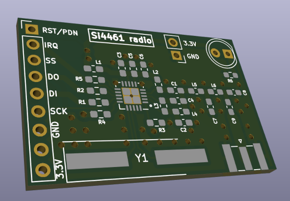

# si446x dev board and software

Generic development board and driver software for Si446x transceivers. The transceiver can be accessed through SPI interface and is designed to directly plug into the Adafruit FT232H board (SPI is implemented on top of GPIO).

## 915MHz CW source

